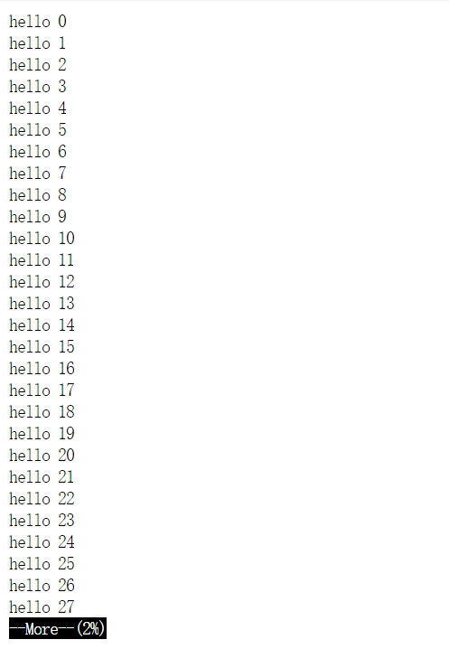
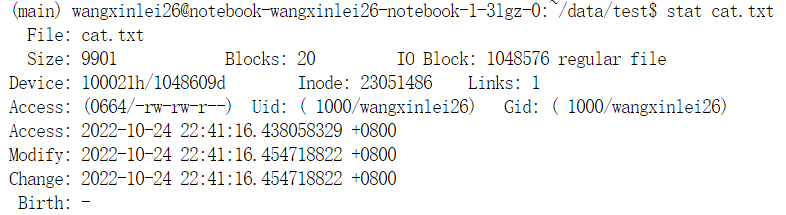

# Linux-Commands

 总结常用的Linux命令

## 1、文件系统

- 目录结构
1. /bin - 基本命令的二进制文件。
2. /boot - 引导加载程序的静态文件。
3. /dev - 设备文件。
4. /etc - 配置文件。
5. /home - 普通用户主目录的父目录。
6. /lib - 共享库文件。
7. /lib64 - 共享64位库文件。
8. /lost+found - 存放未链接文件。
9. /media - 自动识别设备的挂载目录。
10. /mnt - 临时挂载文件系统的挂载点。
11. /opt - 可选插件软件包安装位置。
12. /proc - 内核和进程信息。
13. /root - 超级管理员用户主目录。
14. /run - 存放系统运行时需要的东西。
15. /sbin - 超级用户的二进制文件。
16. /sys - 设备的伪文件系统。
17. /tmp - 临时文件夹。
18. /usr - 用户应用目录。
19. /var - 变量数据目录。

## 2、ls

语法：`ls [选项] [目录]`

功能：ls有多个选项，对于目录，该命令列出该目录下的所有子目录与文件。对于文件，将列出文件名以及其他信息

ls不带选项默认显示当前目录下的文件

> /data/test$ ls
> dir1  dir2  file1  file2

- -l：以列表的形式列出文件详细信息

```
$ ls -ltotal 0
drwxrwxr-x 2 wangxinlei26 wangxinlei26 4096 Oct 24 22:04 dir1
drwxrwxr-x 2 wangxinlei26 wangxinlei26 4096 Oct 24 22:04 dir2
-rw-rw-r-- 1 wangxinlei26 wangxinlei26    0 Oct 24 22:04 file1
-rw-rw-r-- 1 wangxinlei26 wangxinlei26    0 Oct 24 22:04 file2
```

- 其他选项
  
  -a：显示以点开头的文件和目录（隐藏文件）。
  -R：遇到目录要进行递归展开（继续列出目录下面的文件和目录）。
  -d：只列出目录，不列出其他内容。
  -S / -t：按大小/时间排序。

- 查看当前文件有多少个文件

| 功能                  | 命令                           |
| ------------------- | ---------------------------- |
| 查看目录下有多少个文件及文件夹     | ls \| wc -w                  |
| 查看目录下有多少个文件         | ls \| wc -c                  |
| 查看文件夹下有多少个文件，多少个子目录 | ls -l \|wc -l                |
| 若只想知道文件的个数          | /bin/ls -l \|grep ^- \|wc -l |

## 3、file

功能：查看文件类型

语法：`file [文件]`

```text
$ file cat.txt
cat.txt: UTF-8 Unicode text             #类型是文本文件
$ file ret      
ret: directory           #类型是目录文件
```

## 4、pwd

功能：显示当前路径

语法：`pwd`

> $ pwd
> /home/wangxinlei26/data/test

## 5、whoami

功能：显示当前用户

```
$ whoami
wangxinlei26
```

## 6、cd

功能：切换路径

用法：`cd [想要切换的路径]`

Linux是以多叉树的结构管理文件的，磁盘上的文件和目录被组成一棵目录树，每个节点都是目录或文件。根目录：`/`

- cd 绝对命令
  
  > cd /home/data/test/dir

- cd 相对命令
  
  > $ pwd
  > /home/data/test
  > 
  > $ cd dir

- 其他选项
  
  > cd ..：返回上一级目录
  > 
  > cd ~：返回当前用户目录下
  > 
  > cd -： 返回最近一次访问的路径

## 7、which

功能：查看指令的系统路径和相关信息

语法：`which [指令]`

```
$ which ls
alias ls='ls --color=auto'       #alias：给指令取别名
 /usr/bin/ls       #我们的指令都是系统简化过的
$ which ll        
alias ll='ls -l --color=auto'    #ll可以代替ls -l
 /usr/bin/ls                                     
$ which cd    #同时我们发现指令都是在bin目录下的
/usr/bin/cd
```

指令本质上就是程序，Linux中，指令、命令、工具都是可执行程序 ，都存放在普通文件中，linux下一切皆文件，我们的指令都在bin目录下

## 8、 新建文件和文件夹

### 8.1 touch

功能：新建文件，更改文档或目录的日期，包括存取时间和更改时间

```
$ touch file1 file2 file3   #touch可以连续创建多个文件
$ touch file4               #创建单个文件
$ ls
file1  file2  file3  file4
```

### 8.2 mkdir

功能：新建目录文件，也可以同时创建多个目录文件

```
$ mkdir dir1 dir2
$ mkdir dir3
$ ls
dir1 dir2 dir3
```

- -p：递归新建多个子目录

```
$ mkdir -p dir1/dir2/dir3
```

## 9、rm

功能：删除文件和文件夹

选项：

- -f：强制删除
- -r：删除目录及目录下的所有文件，以递归的方式。

## 10、cp&mv

## 10.1 cp

功能：复制文件或目录

语法：`cp [选项] [源文件] [目标文件] [指定目录]`

选项：

- -f：强行复制文件或目录， 不论目的文件或目录是否已经存在
- -r：递归处理，将指定目录下的文件与子目录一并处理。

## 10.2 mv

功能：移动文件或重命名文件

用法：`mv [选项] [源文件] [目标文件]`

选项：

- -f ：force 强制的意思，如果目标文件已经存在，不会询问而直接覆盖
- -i ：若目标文件 (destination) 已经存在时，就会询问是否覆盖！

> 注：如果mv后面跟的不是文件，而是文件名，就会将文件重命名

## 11、查看文件内容

### 11.1 cat

功能：查看文件内容

语法：cat [选项] [文件]

选项：

- -b ：对非空输出行编号
- -n ：对输出的所有行编号
- -s ：不输出多行空行

### 11.2 more

功能：和cat类似，一般用于查看日志，内容比较长的文件

选项：

- -n ：对行编号
- q ：退出more

写一个1000行的文件：

```
count=0; while [ $count -le 1000 ]; do echo "hello ${count}"; let count++; done > cat.txt
```




more会先显示一部分内容，按回车就可以继续读取内容，按q退出，但more有一个弊端，只能往下翻，不能往上翻，所以我们一般不用more指令

### 11.3 less

功能：查看文件内容，less用法比more更具有弹性，可以使用 `[pageup][pagedown]` （前后按键）等按键的功能来往前往后翻看文件，而且less在查看之前不会加载整个文件。

选项：

- -i ：忽略大小写
- -N :显示行号
- /字符串：向上搜索字符串的内容
- ?字符串：向下搜索字符串的内容
- n ：重复前一个搜索（与/ 或?有关）
- N：返向重复前一个搜索（与/ 或?有关）
- q：退出less

### 11.4 head

功能：显示文件内容的开头到标准输出，也就是屏幕上，head不加参数默认显示前10行

选项：`-n<行数>`

```
$ head -n5 cat.txt   #指定输出前5行
hello 0
hello 1
hello 2
hello 3
hello 4
```

### 11.5 tail

功能:用于显示指定文件末尾内容，我们一般查看日志时肯定是查看最新的内容，也就是从尾部开始查看，tail就能很好的帮助我们查看最近的内容

选项：

- -f ：循环读取
- `-n<行号>` ：显示行数

```
$ tail -5 cat.txt   #n可以省略
hello 996
hello 997
hello 998
hello 999
hello 1000
```

### 11.6 查看文件中间内容

比如要显示第100行到110行，有两种方法：

- 方法一：

```
$ head -110 cat.txt > temp
$ tail temp
```

- 方法二：

```
$ head -110 cat.txt | tail -10
```

## 12、往文件里写入

### 12.1 echo

功能：将字符串显示到标准输出，也就是屏幕上，echo默认换行

```
$ echo

$ echo "hello linux"
hello linux
```

- 重定向

通过重定向，字符串后面加 > 符号和文件名，就可以将本该显示到标准输出的字符串，写入文件中，如果文件不存在，就会自动创建文件

```
$ echo "hello linux" > file
$ cat file
hello linux
```

在文件末尾追加内容：

```
$ echo "hello world" >> file
$ cat file
hello linux
hello world
```

## 13、date

格式

- %H : 小时(00..23)
- %M : 分钟(00..59)
- %S : 秒(00..61)
- %X : 相当于 %H:%M:%S
- %d : 日 (01..31)
- %m : 月份 (01..12)
- %Y : 完整年份 (0000..9999)
- %F : 相当于 %Y-%m-%d

```
$ date                 #date默认显示
Fri Jan 28 16:55:54 CST 2022
$ date +%s             #date +%s显示时间戳
1643360162
$ date +%F%X           #按年月日 时分秒的格式显示当前时间
2022-01-2804:56:08 PM
$ date +%F%X@1643360162  # @时间戳，将时间戳转换成标准时间
2022-01-2804:56:27 PM@1643360162
```

## 14、cal

功能：查看日历

选项：

- -3 显示系统前一个月，当前月，下一个月的月历
- -y 显示当前年份的年历
- cal默认显示当前月的月历

## 15、find

功能：在文件数中查找文件，并做出相应的处理（可能会访问磁盘），find指令会帮我们在当前目录以及所有该目录的所以子目录下查找相应的文件，当我们遍历一个大的文件系统时，可能会花费一点时间，然后显示相应的文件信息，但当我们下一次再用find查找时，就会快很多

语法：`find [起始目录位置] [-name][filename]`

## 16、grep

功能：文本行过滤，搜索字符串。grep可以使用正则表达式

常用选项：

- -i：忽略大小写，大小写视为相同
- -n：输出行号
- -v：反向选择

```
$ cat cat.txt | grep '100'
hell0 100
```

- 查看python正在执行的程序

> Ps aux | grep python

## 17、tmux

| 功能                  | 命令               |
| ------------------- | ---------------- |
| 创建名为name的会话         | tmux new -s name |
| 恢复上一次的会话            | tmux a           |
| 查看会话列表              | tmux ls          |
| 恢复名为name的会话         | tmux a -t name   |
| 退出会话（直接Ctrl+d会关闭会话） | Ctrl+b ，再按d      |

## 18、df/dh:查看内存

| 功能      | 命令         |
| ------- | ---------- |
| 查看整体内存  | df -h      |
| 查看文件夹大小 | du -sh 文件名 |

## 19、zip、unzip

ip语法：`zip [压缩后的文件名.zip] [目标文件]`

功能：将文件压缩成.zip格式

常用选项：

- -r ：将指定目录下的所有文件和子目录一并处理，按递归方式
- unzip 语法 ：`unzip [压缩文件.zip]`
- -d：压缩到指定路径下

## 20、tar

和`zip/unzip`类似，不过解压后的文件后缀为`.tgz`

功能：完成打包，压缩，解压

选项：

- -c ：建立一个压缩文件的参数指令(create 的意思)
- -x ：解开一个压缩文件的参数指令
- -t ：查看 tarfile 里面的文件！
- -z ：是否同时具有 gzip 的属性 ，亦即是否需要用 gzip 压缩
- -j ：是否同时具有 bzip2 的属性，亦即是否需要用 bzip2 压缩
- -v ：压缩的过程中显示文件！这个常用，但不建议用在背景执行过程！
- -f ：使用档名，请留意，在 f 之后要立即接文件名！不要再加参数！
- -C ：解压到指定目录

通常将`-czf`和`-xzf`配合使用，用来压缩和解压

## 21、bc

功能：可以理解为计算器

直接将计算结果显示到屏幕上，`Ctrl+c`退出

## 22、uname

功能：获取电脑和操作系统相关信息

选项：

- -a ：输出详细信息，依次为内核名称，主机名，内核版本号，内核版本，硬件名，处理器类 型，硬件平台类型，操作系统名称
- -r ：输出内核版本号

## 23、shutdown

选项：

- -h：将系统的服务停掉后立即关机
- -r：将系统服务停掉后重新启动
- `-t second：-t [秒数]`，即过几秒后关机

## 24、stat

功能：查看文件详细信息

用法 ：`stat [文件]`



文件的相关信息：

- `File`：显示文件名
- `Size`：显示文件大小
- `Blocks`：文件使用的数据块总数
- `IO Block`：IO块大小
- `regular file`：文件类型（常规文件）
- `Device`：设备编号
- `Inode`：Inode号
- `Links`：链接数
- `Access`：文件的权限
- `Gid、Uid`：文件所有权的Gid和Uid

## 25、nvidia-smi

Linux中如果有NVIDIA显卡，使用nvidia-smi命令可以查看显卡信息

- 对nvidia-smi显示界面进行详细解读  
  

- 以一定周期输出上述界面信息

> nvidia-smi -l

## 26、用户管理

1. 创建和删除用户 - useradd / userdel。

> [root home]# useradd user1
> [root home]# userdel user1

2. 修改密码 - passwd。

> [root ~]# passwd user1
> New password: 
> Retype new password: 
> passwd:all authentication tokens updated successfully.

说明：输入密码和确认密码没有回显且必须一气呵成的输入完成（不能使用退格键），密码和确认密码需要一致。如果使用passwd命令时没有指定命令作用的对象，则表示要修改当前用户的密码。如果想批量修改用户密码，可以使用chpasswd命令。

> -l / -u - 锁定/解锁用户。
> -d - 清除用户密码。
> -e - 设置密码立即过期，用户登录时会强制要求修改密码。
> -i - 设置密码过期多少天以后禁用该用户。

3. 切换用户 - su。

> [root ~]# su user1
> [user1root]$

4. 以管理员身份执行命令 - sudo。

> [user1~]$ ls /root 
> ls: cannot open directory /root: Permission denied 
> [user1~]$ sudo ls /root 
> [sudo] password for user1:

说明：如果希望用户能够以管理员身份执行命令，用户必须要出现在sudoers名单中，sudoers文件在 /etc目录下，如果希望直接编辑该文件也可以使用下面的命令

## 27、Linux命令行常用快捷键

| 快捷键        | 功能                     |
| ---------- | ---------------------- |
| tab        | 自动补全命令或路径              |
| Ctrl+a     | 将光标移动到命令行行首            |
| Ctrl+e     | 将光标移动到命令行行尾            |
| Ctrl+f     | 将光标向右移动一个字符            |
| Ctrl+b     | 将光标向左移动一个字符            |
| Ctrl+k     | 剪切从光标到行尾的字符            |
| Ctrl+u     | 剪切从光标到行首的字符            |
| Ctrl+w     | 剪切光标前面的一个单词            |
| Ctrl+y     | 复制剪切命名剪切的内容            |
| Ctrl+c     | 中断正在执行的任务              |
| Ctrl+h     | 删除光标前面的一个字符            |
| Ctrl+d     | 退出当前命令行                |
| Ctrl+r     | 搜索历史命令                 |
| Ctrl+g     | 退出历史命令搜索               |
| Ctrl+l     | 清除屏幕上所有内容在屏幕的最上方开启一个新行 |
| Ctrl+s     | 锁定终端使之暂时无法输入内容         |
| Ctrl+q     | 退出终端锁定                 |
| Ctrl+z     | 将正在终端执行的任务停下来放到后台      |
| !!         | 执行上一条命令                |
| !数字        | 执行数字对应的历史命令            |
| !字母        | 执行最近的以字母打头的命令          |
| !$ / Esc+. | 获得上一条命令最后一个参数          |
| Esc+b      | 移动到当前单词的开头             |
| Esc+f      | 移动到当前单词的结尾             |

##### **指令一览**

- 安装和登录命令：`login、shutdown、halt、reboot、install、mount、umount、chsh、exit、last`
- 文件处理命令：`file、mkdir、grep、dd、find、mv、ls、diff、cat、ln`
- 系统管理相关命令：`df、top、free、quota、at、lp、adduser、groupadd、kill、crontab`
- 网络操作命令：`ifconfig、ip、ping、netstat、telnet、ftp、route、rlogin、rcp、finger、mail、 nslookup`
- 系统安全相关命令：`passwd、su、umask、chgrp、chmod、chown、chattr、sudo ps、who`
- 其它命令：`tar、unzip、gunzip、unarj、mtools、man、unendcode、uudecode`
